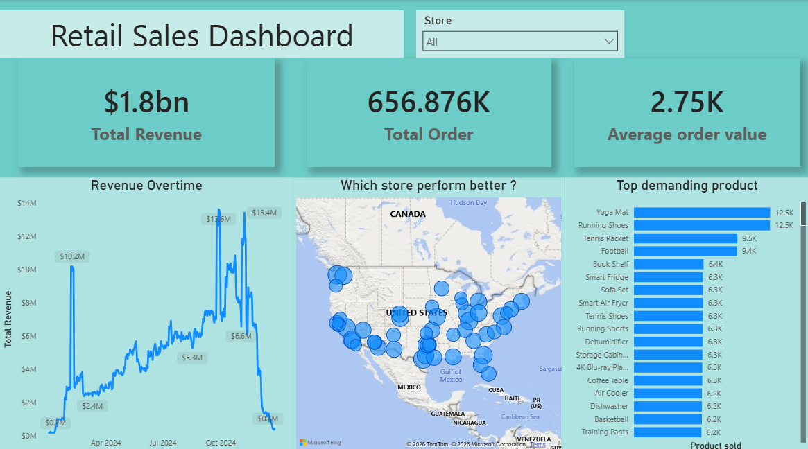

# Retail-Sales-Performance-Project
📊 **Project Overview**
This project showcases an end-to-end data engineering and analytics workflow. I built a robust pipeline to extract raw retail data from a MySQL database, performed complex ETL (Extract, Transform, Load) processes to resolve data type mismatches, and designed an interactive Power BI dashboard to deliver actionable executive insights.

🛠️ **Technical Stack**
Database: MySQL (Relational Schema)
Analytics Tool: Power BI Desktop
Modeling: Star Schema (Fact & Dimension tables)
Languages: SQL (Data extraction), DAX (Advanced measures), Markdown

🧩 **Challenges & Solutions**
During the development of this project, several technical hurdles were overcome:
Database Authentication: Resolved connection issues by switching from Windows to Database authentication and configuring the local host (127.0.0.1:3306) to bridge the gap between MySQL and Power BI.
Data Type Mismatches: Fixed "Flat Line" visual errors by transforming Date/Time timestamps into standard Date formats in Power Query, enabling a 1-to-many relationship between the Calendar and Fact tables.
Large Scale Volume: Optimized the model to handle over 656,000 rows, maintaining fast dashboard performance through efficient star-schema modeling.

📈 **Key Insights & Results**
Total Revenue: $1.8bn processed and visualized.
Q4 Surge: Identified a massive growth trend starting in September and peaking in late October with a daily high of $13.6M.
Product Leaders: Fitness apparel and equipment (Yoga Mats, Running Shoes) were identified as the primary volume drivers.
High-Value Transactions: Calculated an Average Order Value (AOV) of $2.75K, signaling a premium customer segment.

🚀 **How to Replicate**
MySQL Setup: Import the retail schema into your local MySQL instance.
Power BI Connection: Open the .pbix file.
Authentication: Go to Data Source Settings, select Edit Permissions, and use your MySQL root credentials under the Database tab.
Transformation: Ensure the sales_date in the Fact table is set to Date type to activate the relationship with the Calendar table.

💡**Strategic Recommendations**
Inventory: Increase Q4 stock levels for fitness products by 40% based on historical October peaks.
Marketing: Prioritize spend on the Eastern Seaboard and Southern regions where sales density is highest.
